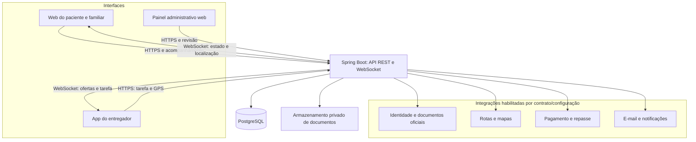
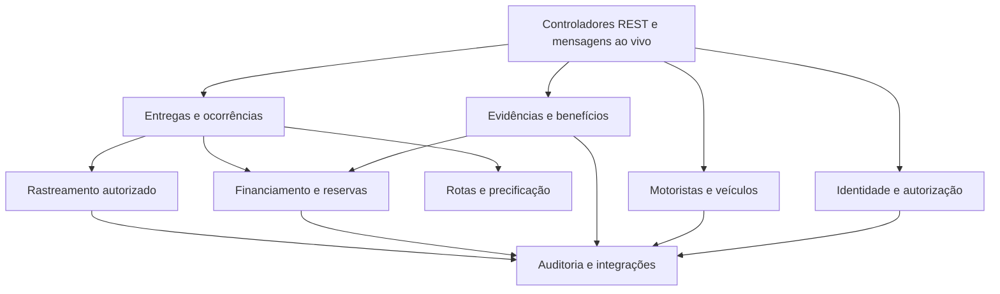
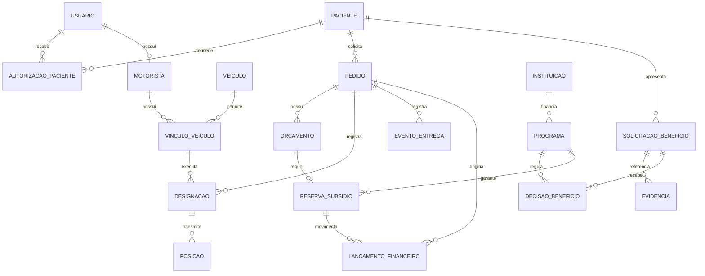
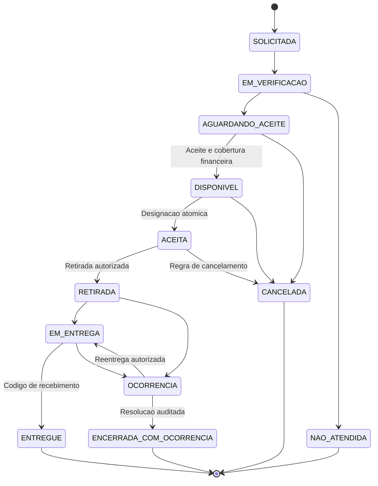
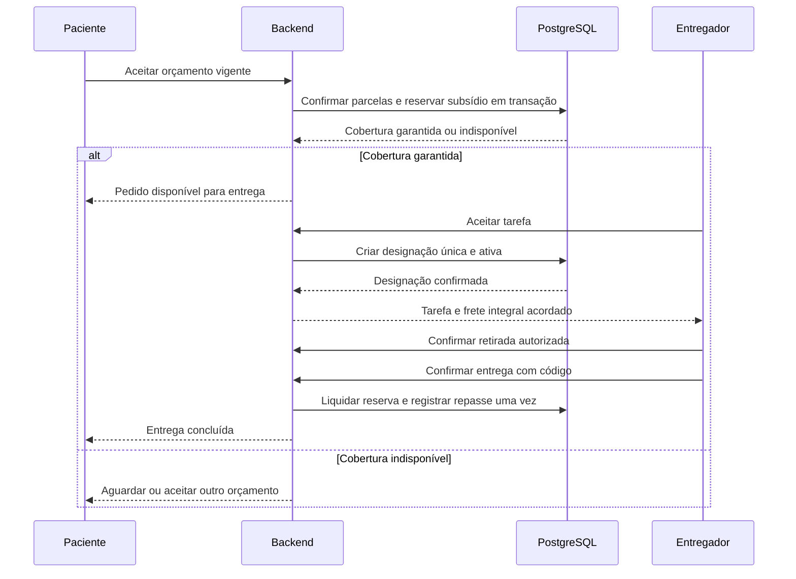
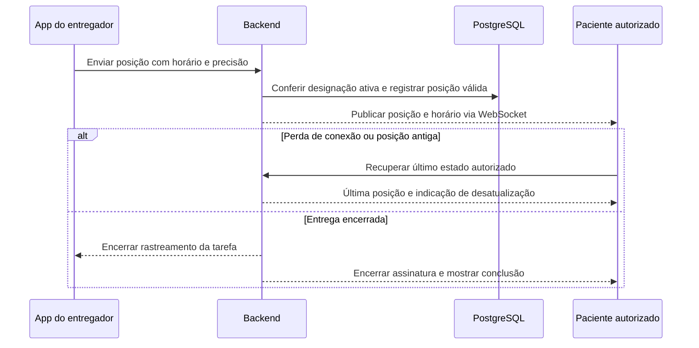

# Diagramas

Desenho inicial — 29/09/2026. As caixas representam componentes e capacidades planejados, não serviços já implementados, credenciados ou contratados. Integrações externas ficam indisponíveis até habilitação real.

## Componentes e comunicação

Nenhum cliente acessa o banco diretamente. O backend autoriza cada consulta, envio de posição e assinatura ao vivo. Fotos operacionais são entregues somente a participantes autorizados da tarefa; documentos de análise não são publicados.

## Módulos do backend

Um processo inicial e um banco, com responsabilidades separadas por módulo. Integrações compartilham adaptadores; não é proposta de nove microserviços.

## Modelo de dados conceitual

Modelo conceitual, ainda sem migração. Restrições futuras: uma designação ativa por pedido; um orçamento aceito vigente; vínculo de veículo e motorista aprovados; decisão de benefício atribuída ao paciente; programa e reserva da mesma instituição; idempotência dos lançamentos. Pedido pode não usar subsídio, então lançamentos particulares não dependem de reserva. Evidências clínicas e financeiras precisam de acesso restrito e retenção própria.

## Estados da entrega

Cancelamento e encerramento não estornam automaticamente serviço já prestado. Estado de pagamento, benefício e reserva é separado do estado da entrega. Reentrega não cria custo adicional sem autorização e cobertura.

## Aceite e liquidação

Confirmação de pagamento real depende do provedor habilitado e dos eventos autenticados correspondentes. Registro de repasse a pagar não equivale a dinheiro transferido; confirmação de transferência vem da integração ou conciliação comprovada.

## Rastreamento ao vivo

O app enfileira somente dados recentes com limites e política de descarte; reconexão não reproduz pontos antigos como se fossem atuais. Autorização é reavaliada no envio e no recebimento, e o fechamento da tarefa encerra compartilhamento.
