# Diagramas

Planejamento técnico — 30/09/2026. As caixas representam componentes e capacidades planejados, não serviços já implementados, credenciados ou contratados. Integrações externas ficam indisponíveis até habilitação real.

## Componentes e comunicação

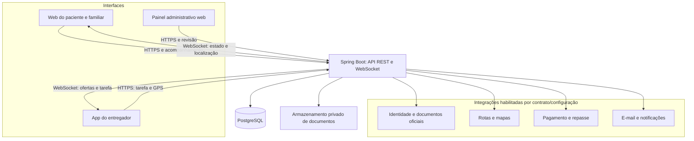

Nenhum cliente acessa o banco diretamente. O backend autoriza cada consulta, envio de posição e assinatura ao vivo. Fotos operacionais são entregues somente a participantes autorizados da tarefa; documentos de análise não são publicados.

### Titular, retenção e expurgo (V15)

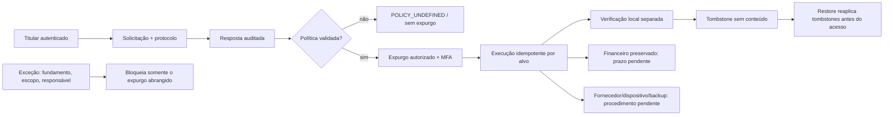

Solicitação respondida não é exclusão executada, e execução não é verificação. `VERIFICADA` limita-se aos recursos locais controlados; finanças são preservadas e dispositivos, backups e fornecedores permanecem fora da comprovação local.

### Backup, diário externo e restauração (V16)

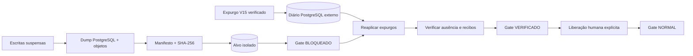

O diário não integra o backup restaurado. Rede isolada e efeitos externos desligados são pré-condições, e `VERIFICADO` ainda bloqueia a API até `release-access.sh`. Checksum detecta corrupção acidental, mas a autenticidade/cifragem do destino depende da infraestrutura real.

## Módulos do backend

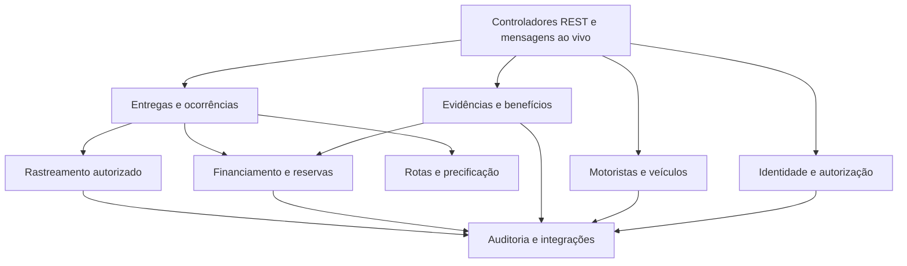

Um processo inicial e um banco, com responsabilidades separadas por módulo. Integrações compartilham adaptadores; não é proposta de nove microserviços.

## Modelo de dados conceitual

### Fluxo de benefício e revisão

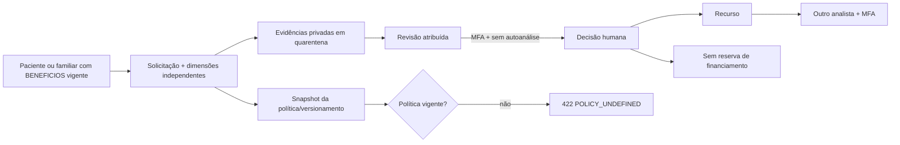

### Conciliação de aporte

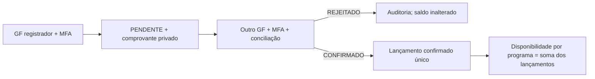

### Pedido e orçamento particular (V9)

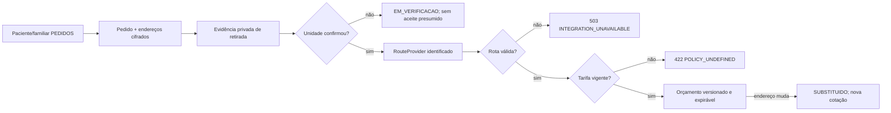

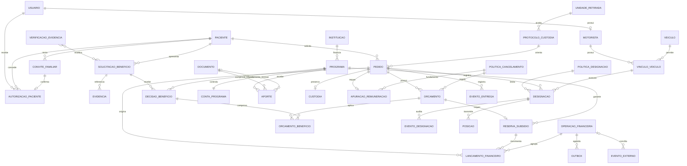

Visão resumida do [modelo físico](MODELO-DADOS.md). V1–V16 materializam conta/sessão, representação, evidências e revisão local, benefício/aporte, pedido/orçamento, aceite/cobertura, designação, custódia/entrega comprovada, posições de tarefa ativa, obrigação/repasse reconciliável, trilha de solicitação/expurgo e gate/recibos de restauração. V13 deduplica posição por designação/sequência e indexa a última posição; habilitação real continua bloqueada pela retenção não aprovada. V14 separa liquidação local de transferência externa, preserva referência em timeout e mantém divergências auditáveis. V15 não promove os prazos propostos a política e limita `VERIFICADA` aos recursos controlados. V16 não substitui isolamento de rede nem o diário externo. Pedido particular não depende de instituição/reserva, mas só vira oferta após pagamento confirmado; subsidiado só vira oferta com reserva integral ainda ativa. Evidências clínicas e financeiras permanecem fora da projeção operacional.

### Ticket 06 — vínculo e revisão versionada

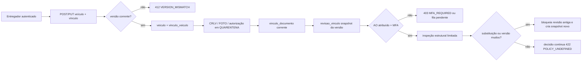

O fluxo não consulta fonte oficial, não libera ofertas e não trata inspeção de estrutura como autenticidade documental ou varredura antimalware.

## Entregador, quarentena e revisão — ticket 05 parcial

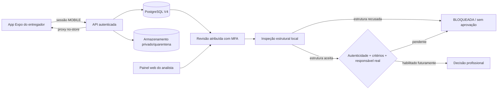

O armazenamento local privado, a atribuição com TOTP e a inspeção estrutural limitada foram exercitados com dados sintéticos. A inspeção trata segurança básica do arquivo; não prova autenticidade do documento, situação profissional nem elegibilidade. Critérios profissionais e responsável real continuam ausentes, portanto nenhuma decisão aprova o cadastro ou habilita entregas. Armazenamento externo só será dependência quando os requisitos de operação/deploy o exigirem; sua ausência não invalida o ensaio local. Foto operacional só poderá ser projeção de documento profissionalmente aprovado, nunca aprovação automática.

## Estados da entrega

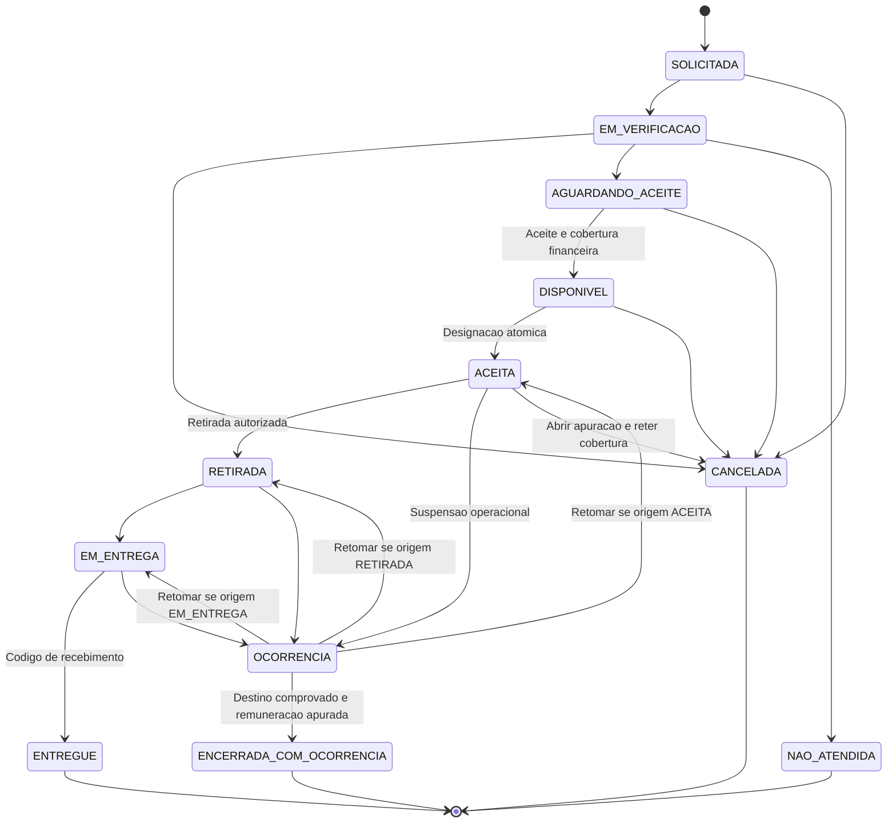

Cancelamento pré-retirada interrompe deslocamento, abre apuração quando houver designação e conserva cobertura; não gera integral nem libera tudo automaticamente. Depois da retirada, ocorrência mantém custódia/retorno até destino comprovado. Nenhuma unidade está confirmada; operação real bloqueada. Estado de pagamento, benefício e reserva é separado do estado da entrega. Reentrega não cria custo adicional sem autorização e cobertura.

## Aceite e liquidação

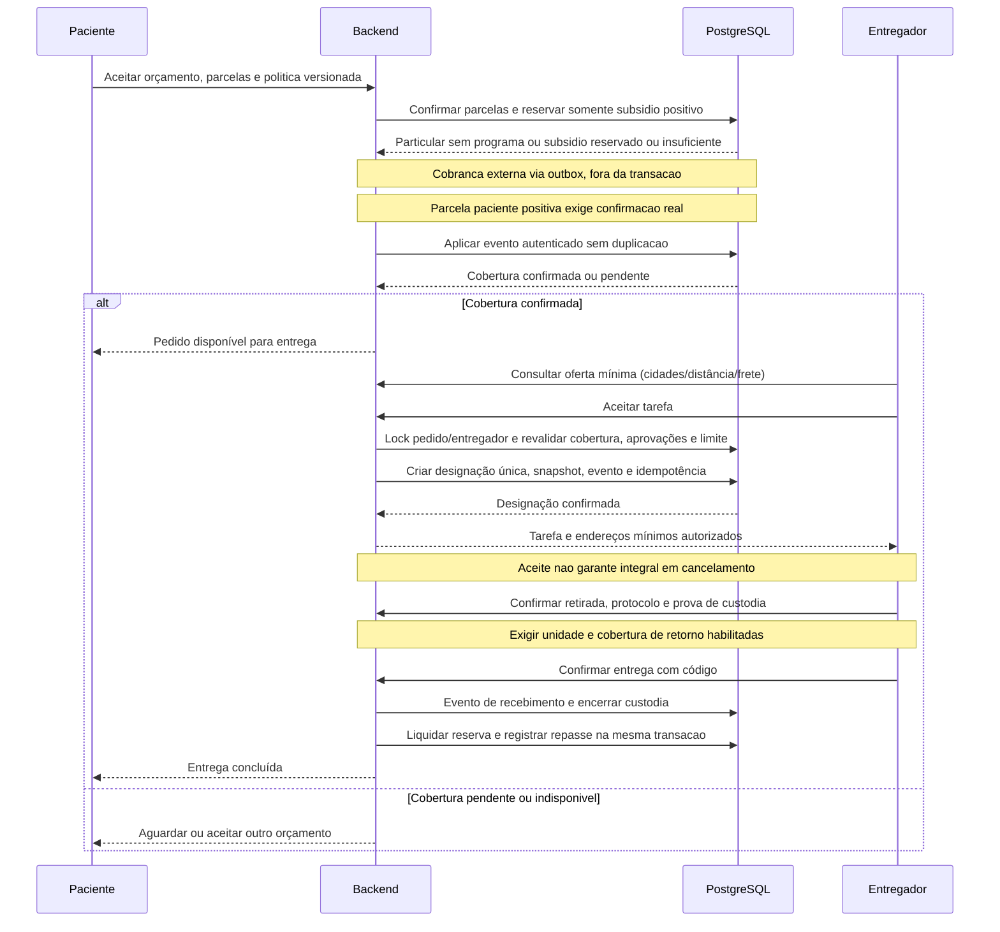

Confirmação de pagamento real depende do provedor habilitado e dos eventos autenticados correspondentes. Registro de repasse a pagar não equivale a dinheiro transferido; confirmação de transferência vem da integração ou conciliação comprovada.

V10 implementa a fronteira de cobertura; V11 implementa oferta/designação; V12 implementa retirada, início de entrega, código de recebimento, custódia e ocorrência com locks e idempotência. Retorno, reentrega, liquidação e cancelamento pós-designação continuam bloqueados por políticas ausentes. Aprovações profissionais, capacidade e protocolos reais permanecem indisponíveis; testes usam substitutos somente no banco descartável.

## Rastreamento ao vivo

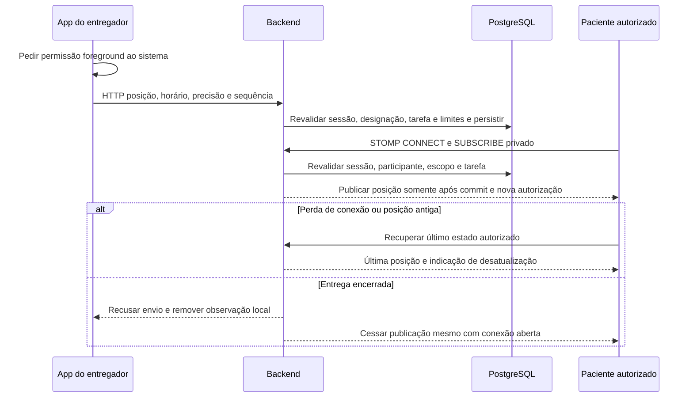

O app enfileira no máximo oito pontos de até dois minutos e envia no máximo um corpo de 1 KiB por vez; o servidor limita oito pontos por janela móvel de dois minutos. Reconexão consulta novamente a última posição, preservando `stale` após 60 s, e nunca reproduz ponto antigo como atual. Autorização é reavaliada no envio, assinatura e publicação. Logout, revogação, expiração e fechamento cessam o acesso das conexões abertas. Captura em segundo plano, bateria e precisão física continuam sem evidência de aparelho.

## Estados financeiros independentes

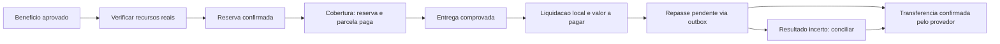

Timeout não confirma transferência. [Contrato HTTP](../contracts/openapi.yaml) e [permissões/STOMP](SEGURANCA.md) detalham comandos e participantes. O [backlog](../.scratch/planejamento/README.md) mantém as dependências por fatia funcional.

## Convite e confirmação do adulto — D03, implementado no ticket 04

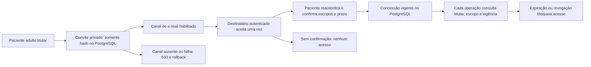

O perfil permanece com identidade PENDENTE; e-mail, CPF, parentesco, idade ou deficiência não o tornam verificado nem concedem acesso. Menores e representação legal permanecem fora da cobertura inicial. Documento/foto e STOMP são integrações futuras que deverão reautorizar cada acesso/despacho; não foram presumidos nesta implementação.

## Cancelamento e custódia — D06

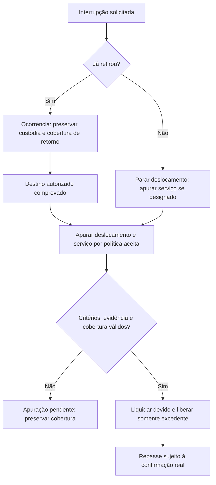

Sem designação/serviço não criar remuneração; reconciliar cobrança/reserva. Valores/multas/responsabilidades continuam pendentes. As hipóteses de GPS D09 ainda exigem ensaio real; nenhuma adequação declarada.

## Marco local e habilitação — D12

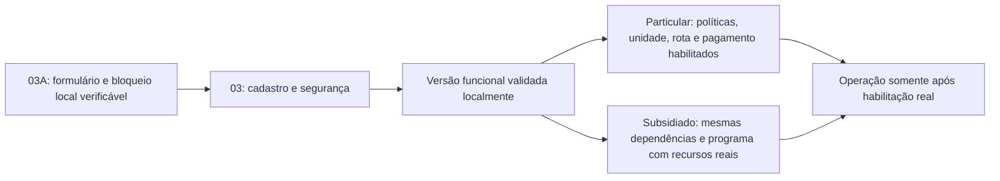

Não há piloto presumido, compra ou deploy autorizado. MFA/segregação são arquitetura adotada; políticas/responsáveis pendentes e integrações indisponíveis mantêm guardas independentes. Cadastro e segurança não dependem de programa subsidiado.

## Conta, sessão e recuperação — implementado no ticket 03

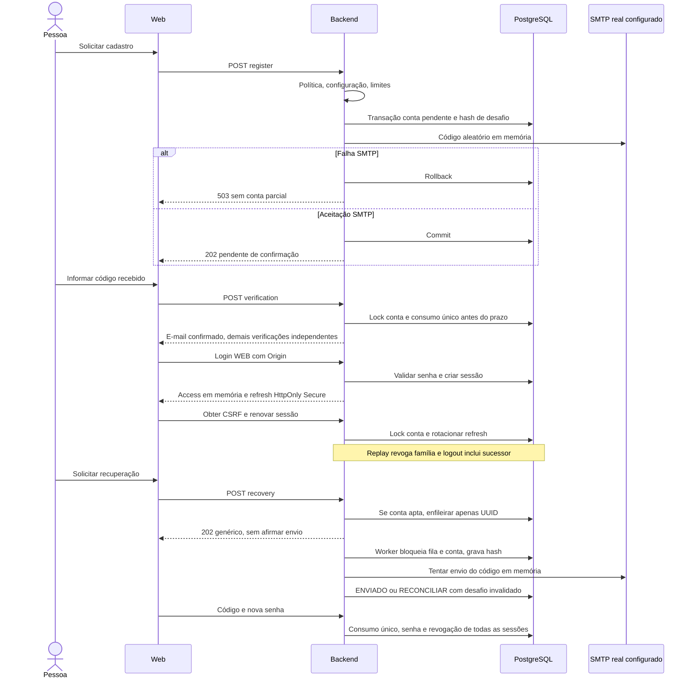

SMTP aceito não prova chegada à caixa do destinatário. Queda entre envio e commit pode gerar código inválido; nova solicitação é necessária. O ensaio de navegador usa capturador de e-mail exclusivamente nos testes; integração real permanece não homologada.
